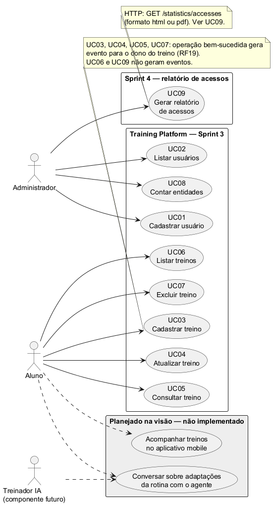

# Casos de uso

Os atores representam a intenção de uso do produto. A API atual não autentica
nem autoriza por papel; qualquer cliente local pode executar as operações.
O treinador IA é componente futuro, não um terceiro tipo de usuário.

| ID | Caso de uso | Resultado e alternativas | Requisitos |
| --- | --- | --- | --- |
| [UC01](UC01-cadastrar-usuario.md) | Cadastrar usuário | 201; inválido 422, duplicado 409, persistência 503. | RF01–RF03, RF05–RF07, RF16 |
| UC02 | Listar usuários | 200 e lista (inclusive vazia); persistência 503. | RF04, RF05, RF16 |
| [UC03](UC03-cadastrar-treino.md) | Cadastrar treino | 201; inválido 422, usuário ausente 404, persistência 503. | RF08, RF09, RF14–RF16, RF19–RF20, RF23 |
| [UC04](UC04-atualizar-treino.md) | Atualizar treino | 200 e guarda o estado anterior; inválido 422, treino ausente 404, persistência 503. | RF09, RF12, RF15–RF16, RF19–RF20, RF23, RF25–RF26 |
| [UC05](UC05-consultar-treino.md) | Consultar treino | 200; ID inválido 422, ausente 404, persistência/registro 503. | RF10, RF16, RF19–RF20, RF23 |
| UC06 | Listar treinos | 200 e lista ordenada por ID; persistência 503; **sem evento**. | RF11, RF15, RF16 |
| [UC07](UC07-excluir-treino.md) | Excluir treino | 204 sem corpo; ID inválido 422, ausente/repetido 404, persistência 503. Remove o Memento. | RF13, RF14, RF16, RF19–RF20, RF23, RF25 |
| UC08 | Contar entidades | 200 com total inteiro de usuários + treinos; persistência 503. | RF17, RF18 |
| [UC09](UC09-gerar-relatorio-acessos.md) | Gerar relatório de acessos | 200 HTML/PDF; inválido 422, falha 503; **sem novo evento**. Cinco operações, incluindo `undo`. | RF21–RF23, RF27 |
| [UC10](UC10-desfazer-atualizacao.md) | Desfazer atualização de treino | 200 restaura nome e descrição; sem histórico 409, ausente 404, ID inválido 422, persistência 503. | RF24–RF27 |

Pré-condição comum: API iniciada com RAM ou SQLite. UC03 exige usuário existente;
UC04, UC05, UC07 e UC10 exigem treino existente para o fluxo de sucesso. UC10
também exige uma atualização anterior ainda não desfeita. Eventos de uso
(RF19) associam-se ao **proprietário do treino**, não ao cliente HTTP — ver
[guia Sprint 4](../sprint4/README.md) e [UC10](UC10-desfazer-atualizacao.md).

[Fonte PlantUML](../diagramas/casos-de-uso-usuarios.puml).
O bloco futuro deriva da [visão](../01-visao.md), sem afirmar implementação.
UC09 integra o relatório da Sprint 4. UC10 integra o desfazer da Sprint 5.
Os contratos normativos ficam em
[usuários](../../openspec/specs/usuarios/spec.md),
[treinos](../../openspec/specs/treinos/spec.md),
[fachada](../../openspec/specs/fachada/spec.md),
[relatorio-de-acessos](../../openspec/specs/relatorio-de-acessos/spec.md) e
[desfazer-atualizacao](../../openspec/specs/desfazer-atualizacao/spec.md).
