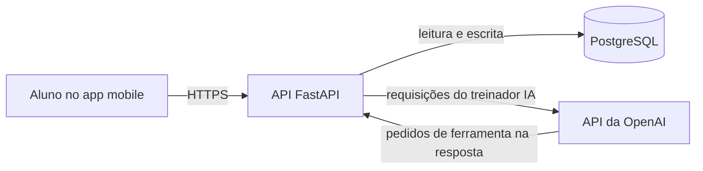

# Arquitetura do projeto

## Estado atual

No Laboratório 2, apenas a API de usuários é executável. O código fica em `app/`: `routers/` e `schemas.py` formam a fronteira HTTP; `users/service.py` valida credenciais e coordena cadastro/listagem; `users/repository.py` implementa o protocolo de persistência em RAM e SQLite; `users/credentials.py` valida login/senha e gera hashes; `users/domain.py` define a entidade. O projeto usa Python 3.12, FastAPI e `pip`. Ainda não há aplicativo mobile, PostgreSQL ou integração com a OpenAI.

## Stack planejada

| Parte | Tecnologias | Papel |
| --- | --- | --- |
| API | Python 3.12 e FastAPI | Expor operações de usuários e treinos, validar acesso e coordenar o agente. |
| Persistência | PostgreSQL e, como ORM proposta, SQLAlchemy 2 | Guardar usuários, treinos, exercícios e histórico quando a coleção em RAM for substituída. |
| Mobile | React Native com Expo | Interface do aluno para solicitar, visualizar e acompanhar treinos. Expo Go será usado nos primeiros testes. |
| Treinador IA | API da OpenAI, chamada pela API do projeto | Consultar dados permitidos e solicitar criação ou edição de treinos por ferramentas do servidor. |

“Alguma ORM” foi interpretado como uma escolha ainda em aberto. [SQLAlchemy](https://docs.sqlalchemy.org/en/20/orm/) é a proposta inicial; a decisão final e as migrações de banco devem ser registradas quando a persistência for implementada. [Expo Go](https://docs.expo.dev/develop/development-builds/faq/) é adequado para prototipar, mas um *development build* será necessário se o app usar bibliotecas nativas que não vêm nele.

## Comunicação entre as partes



O app mobile conversa com a API do projeto. A API é responsável por acessar o PostgreSQL e por executar as ferramentas solicitadas pelo agente. A OpenAI devolve pedidos de ferramenta ao backend; o backend valida os argumentos e executa a operação, sem dar acesso direto ao banco ao modelo. O agente representa o treinador, não um usuário cadastrado como aluno ou administrador. A chave da OpenAI ficará no ambiente do servidor, não no aplicativo mobile. A [documentação oficial da OpenAI](https://developers.openai.com/api/docs/guides/function-calling) descreve o fluxo de chamadas de ferramentas; suas [práticas de produção](https://developers.openai.com/api/docs/guides/production-best-practices) orientam a guardar a chave fora do código. Uma primeira opção é usar a Responses API com *function calling*; a escolha definitiva será feita quando o agente for implementado.

## Estrutura futura sugerida

Esta árvore representa a direção do projeto, não pastas que já existem:

```text
training-platform/
├── apps/
│   ├── api/
│   │   ├── app/
│   │   │   ├── main.py         # inicialização do FastAPI
│   │   │   ├── routers/        # endpoints HTTP
│   │   │   ├── users/          # cadastro e perfis
│   │   │   ├── workouts/       # planos, exercícios e acompanhamento
│   │   │   ├── agent/          # orquestração e ferramentas do treinador IA
│   │   │   └── persistence/    # conexão e modelos do banco
│   │   ├── migrations/         # evolução do esquema do PostgreSQL
│   │   ├── tests/
│   │   └── requirements.txt
│   └── mobile/
│       ├── app.json            # configuração do Expo
│       ├── src/
│       │   ├── features/       # telas e fluxos por funcionalidade
│       │   ├── components/     # componentes reutilizáveis
│       │   └── services/       # cliente da API do projeto
│       └── package.json
└── docs/
```

A API atual permanece em `app/`. Quando houver código mobile, a equipe poderá mover a API para `apps/api/` e criar `apps/mobile/` no mesmo trabalho, ajustando imports, comandos e testes. Não é preciso criar pastas vazias agora. A biblioteca de navegação, o provedor de autenticação, o driver PostgreSQL e a forma exata de orquestrar o agente serão escolhidos nas sprints em que essas partes forem implementadas.

O armazenamento atual é selecionado na inicialização, conforme o [ADR 0003](adr/0003-validacao-persistencia.md). SQLite usa transações e restrições únicas; erros de validação e persistência são tratados na fronteira HTTP. PostgreSQL permanece uma possibilidade futura.
