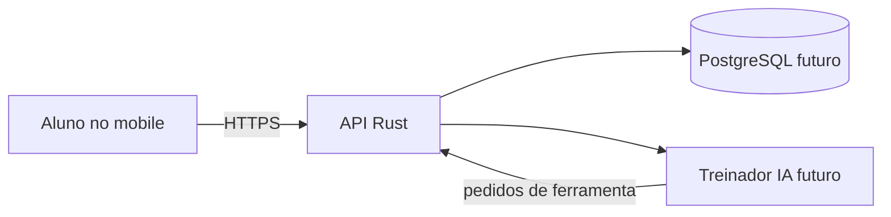

# Arquitetura do projeto

## Estado atual

A Sprint 1 entrega uma API Rust com Axum para cadastrar e listar alunos e administradores em memória.
Cada instância da aplicação possui seu próprio serviço de usuários. Ainda não há
aplicativo mobile, banco de dados ou integração com o treinador de IA.

```text
src/
├── main.rs    # servidor, endereço e encerramento com Ctrl+C ou SIGTERM
├── lib.rs     # roteamento, extração de JSON e respostas HTTP
└── users.rs   # modelos, validação, unicidade e coleção em memória
tests/
└── users.rs   # testes HTTP com estado isolado, sem abrir uma porta
```

`UserService` concentra as regras de cadastro e listagem. Os handlers compartilham
um `Arc<UserService>`; o serviço usa `RwLock<Vec<User>>` para permitir leituras
concorrentes e proteger a verificação de unicidade junto com a inserção. Os erros
do serviço são convertidos em respostas HTTP somente na fronteira da API.

Os papéis são `student` (padrão) e `admin`, representados por um enum Rust.
O papel classifica o usuário e ainda não controla acesso. Nomes preservam a caixa, e-mails são armazenados em
minúsculas e ambos têm espaços externos removidos. Duplicatas são comparadas com
case folding Unicode. Os dados são perdidos quando o processo termina.

## Direção futura

| Parte | Tecnologia ou decisão | Papel |
| --- | --- | --- |
| API | Rust e Axum | Operações de usuários e treinos e coordenação do treinador. |
| Persistência | PostgreSQL; driver e acesso aos dados ainda em aberto | Usuários, treinos, exercícios e histórico. |
| Mobile | React Native com Expo | Interface do aluno para solicitar e acompanhar treinos. |
| Treinador IA | Integração futura pelo servidor | Criação e edição de treinos por ferramentas controladas pela API. |

O mobile conversará com a API por HTTPS. O servidor controlará o acesso ao banco,
validará os argumentos das ferramentas do treinador e manterá as credenciais fora
do aplicativo mobile. O treinador será um agente, sem um papel de usuário próprio.



A estrutura permanece pequena enquanto somente a API existe. Quando houver código
mobile ou persistência, a organização do workspace e as bibliotecas dessas partes
serão decididas na respectiva sprint. Não há ORM ou camadas de repositório nesta etapa.

A migração e suas diferenças públicas estão no [ADR 0003](adr/0003-rust-api.md).
